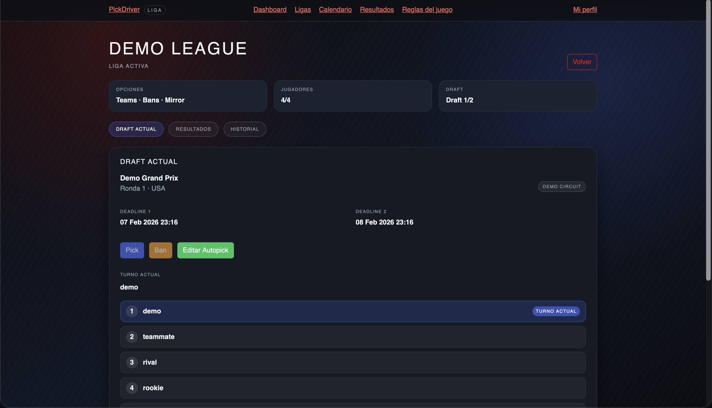

# PickDriver Web

Blazor Server web client for the PickDriver fantasy F1 experience. This repo focuses on the web UI, state handling, and client-side integration patterns.

## Tech Stack

- .NET 10 / C#
- Blazor Server (Interactive Server)
- Bootstrap (UI)
- xUnit + bUnit (tests)
- GitHub Actions (CI/CD)

## Features

- Auth (email/password + Google login when configured)
- Email verification and password reset flows for email/password accounts
- Leagues management (create/join/delete)
- Draft flow and standings UI
- Profile management
- Mock/demo mode (no backend required)

## Screenshots





## Run Locally

```bash
dotnet restore

dotnet run
```

App settings live in `appsettings.json` and `appsettings.Development.json`.

## Configure API URL (Local)

The repo keeps a placeholder API URL by default. For local development, set the real API base URL via environment variable or user-secrets:

```bash
# Environment variable
export Api__BaseUrl="https://api.pickdriver.cc/api/"

# Or user-secrets (stored locally, not committed)
dotnet user-secrets set "Api:BaseUrl" "https://api.pickdriver.cc/api/"
```

To run without a backend, enable mock mode by setting `Api:UseMock` to `true`.

## Mock / Demo Mode

Enable the mock API to run without the backend:

```json
{
  "Api": {
    "BaseUrl": "https://api.example.com/api/",
    "UseMock": true
  }
}
```

See `docs/demo.md` for details.

## Tests

```bash
dotnet test pickdriver-web.sln
```

To collect coverage locally:

```bash
dotnet test pickdriver-web.sln --collect:"XPlat Code Coverage" --results-directory ./TestResults
```

## CI / CD

- CI runs restore/build/test on every push and PR.
- CD is manual and produces a publish artifact.

Workflows live under `.github/workflows/`.

## Notes on Assets

Some image assets under `wwwroot/assets/races/` are sourced from Formula 1 and are not licensed for redistribution. See `NOTICE.md` for details.

## Related Repos

- The API lives in a separate repository and is tested independently.

## License

MIT. See `LICENSE`.
